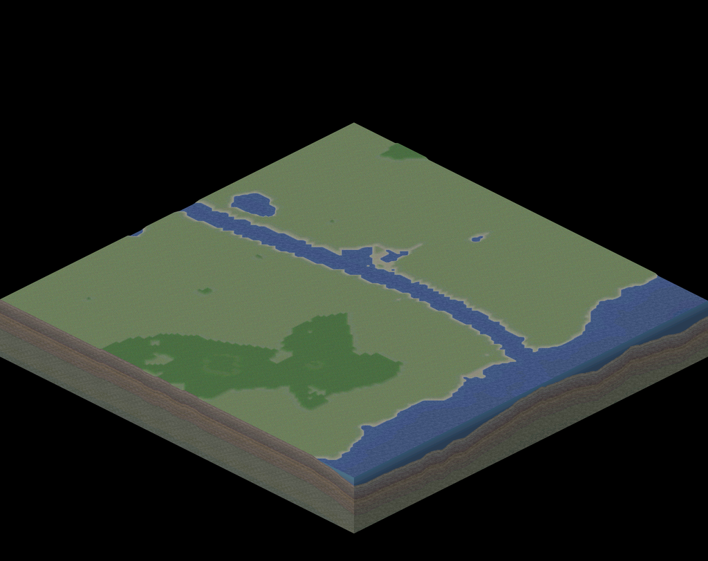
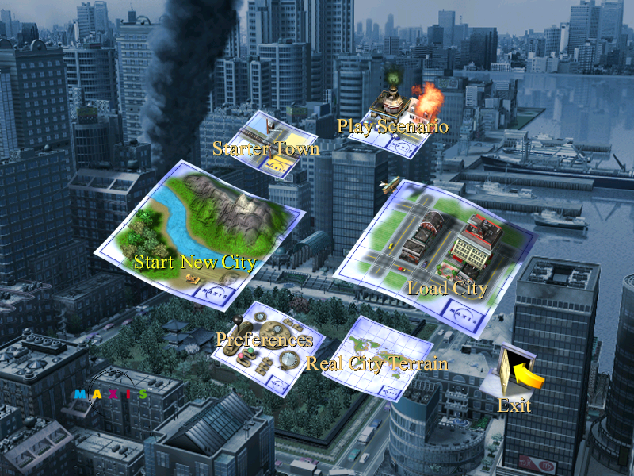
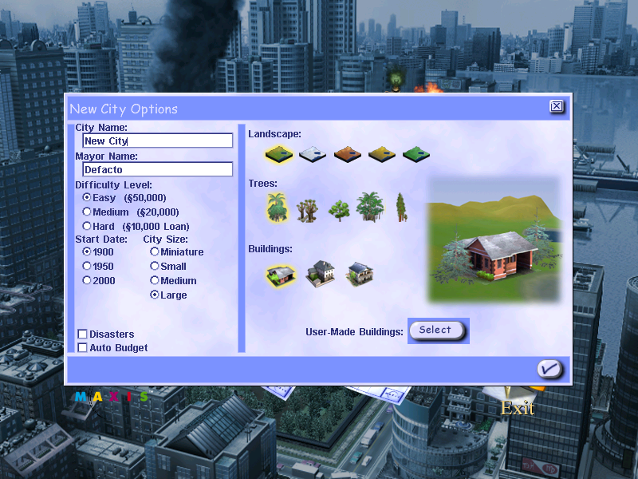
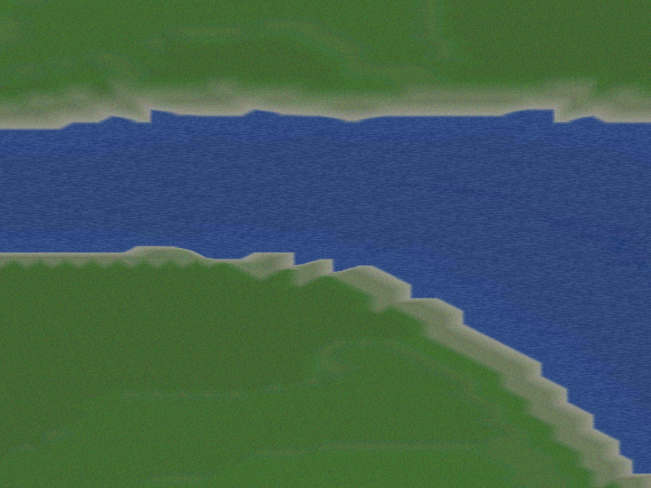
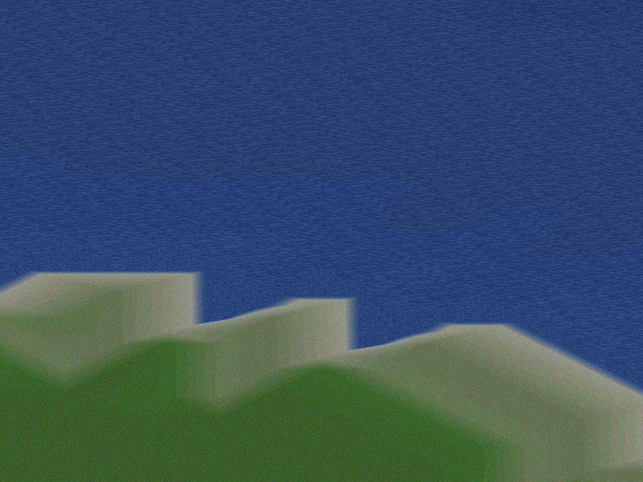
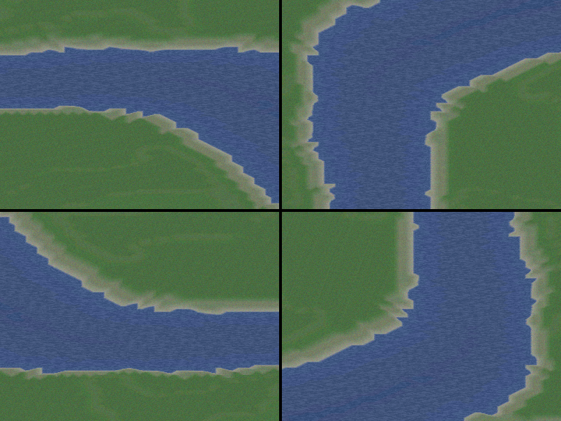
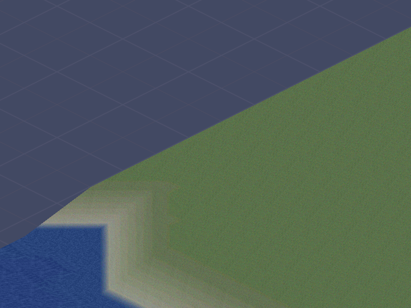
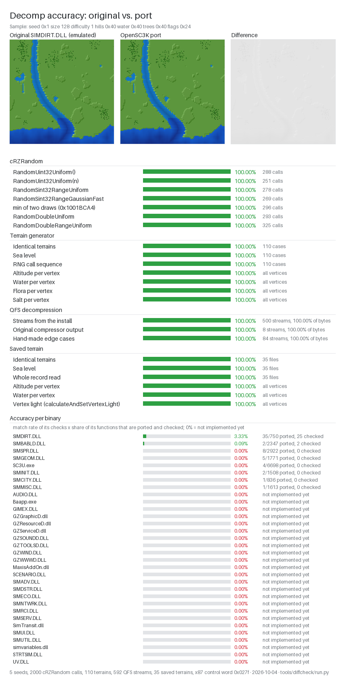

# OpenSC3K

An educational reverse-engineering project and clean-room remake of **SimCity 3000 Unlimited**,
written in Rust.

The original game is studied with Ghidra and documented in `docs/`. That understanding is
reimplemented as a new engine that reads the game data at runtime from your own install. The
aim is to be faithful: the same file formats, random numbers, terrain generator and drawing
rules. Every recovered fact cites the address of the function it came from.

<p align="center">
  
</p>

## Screenshots

| Main menu | New City Options |
|---|---|
|  |  |

| City view, zoom 2 | City view, zoom 4 |
|---|---|
|  |  |

| Four rotations | Map edge and `BACK4.BMP` background |
|---|---|
|  |  |

## Accuracy

<p align="center">
  
</p>

`tools/diffcheck` runs original game DLLs from your install in an x86 emulator. It feeds the
original and the port the same inputs and compares the results: every `cRZRandom` method,
whole generated terrains vertex by vertex together with the order of every random-number call
(`SIMDIRT.DLL`), and QFS decompression (`SIMBABLD.DLL`). It also lists every binary of the game
with how many of its functions are ported and checked; one nothing has been ported from yet is
at 0%. The full results are in [`docs/accuracy.md`](docs/accuracy.md); the method is in
[`docs/re-notes/diffcheck.md`](docs/re-notes/diffcheck.md). To regenerate both:

```bash
pip install -r tools/diffcheck/requirements.txt
tools/diffcheck/run.py all --report docs/accuracy.md --image docs/screenshots/accuracy.png
```

## What works

- **Data:**
  - Archives: IXF/TGI containers, QFS compression, SYS.PAK.
  - Content: UI images, strings, bitmap fonts, sprites and BMP palettes.
- **Startup flow:** the copyright splash, the animated main menu, and the menu music.
- **New City Options dialog:** every control works. OK builds the city model.
- **Terrain generator:** ported from `SIMDIRT.DLL`, using a bit-exact `cRZRandom`. It makes hills,
  sea, rivers, lakes, salt water and flora.
- **Isometric city view, drawn in software:**
  - Land, water, shore and map-edge clods.
  - Per-vertex light, bump noise and zoom haze.
  - Landscape palettes, with `BACK<zoom>.BMP` behind the map.
- **Camera:** five zooms and four rotations. Arrow keys and the screen edges scroll it.
- **Trees:** the generator's flora becomes tree occupants, picked by height and drawn with the
  chosen flora set's sprites.
- **Saved terrains:** `--load` opens a `.sct` terrain or the ground of a `.sc3` city, with its
  trees. The terrain reader and the vertex light match the original `SIMDIRT.DLL` on every file
  in the install (`tools/diffcheck/run.py ground`).

Not yet: buildings, zoning, the simulation tick, the rest of a save, and saving.

## Setup

```bash
export SC3K_DATA="/path/to/SimCity 3000 Unlimited"   # directory containing Apps/, Cities/, ...
cargo test                                            # install-wide tests skip if SC3K_DATA is unset
```

## Run

The game needs your own copy of SimCity 3000 Unlimited; set `SC3K_DATA` as above.

```bash
cargo run --release -p opensc3k                       # splash, then the main menu
cargo run --release -p opensc3k -- --res 1024x768     # other screen sizes; the window scales
cargo run --release -p opensc3k -- --screenshot menu.png --hover 251,297 --time 400
cargo run --release -p opensc3k -- --scene newcity --res 640x480 --click 200,150 --type "Jr." --screenshot nc.png
cargo run --release -p opensc3k -- --scene city --seed 1 --zoom 2 --rotate 1   # straight into a new city
cargo run --release -p opensc3k -- --load "$SC3K_DATA/Cities/Terrains/Boston, MA.sct"   # a saved terrain
```

In a city, the arrow keys and the screen edges scroll. PageUp/PageDown, `+`/`-` and the mouse
wheel zoom, `,` and `.` rotate, and Escape returns to the menu.

## Tools

```bash
cargo run -p sc3k-dump -- list "$SC3K_DATA/Apps/Res/BUILDFAM.IXF"   # TGI index of a container
cargo run -p sc3k-dump -- extract "$SC3K_DATA/Cities/Madison, WI.sc3" out/madison
cargo run -p sc3k-dump -- census                                    # TypeID histogram of the install
cargo run -p sc3k-dump -- images "$SC3K_DATA/Apps/Res/UI/Shared/MAIN.IXF" out/main   # UI images to PNG
cargo run -p sc3k-dump -- terrain 1 256 out/terrain.png                # new-city terrain, top-down
cargo run -p sc3k-dump -- iso 1 128 0 out/iso.png                      # the same, isometric, whole map
cargo run -p sc3k-dump -- iso-file "$SC3K_DATA/Cities/Madison, WI.sc3" 1 out/madison.png   # a saved city's ground
tools/ghidra/import.sh                                              # headless Ghidra import + symbol export
tools/loki/fetch.sh && tools/loki/symbols.sh                         # Linux port symbols (C++ names)
tools/ghidra/import.sh loki                                         # import Linux ELFs for name matching
tools/match/export.sh && tools/match/match.py                       # port Linux names to Windows functions
tools/diffcheck/run.py all                                          # compare the port with the original DLL code
analyzeHeadless ghidra-project SC3U -process SC3U.exe -readOnly -noanalysis \
  -scriptPath tools/ghidra -postScript Decompile.java out.c cSC3MainMenu:: @0x4faa28   # decompile by name/address/xref
```

## Layout

| Path | Purpose |
|---|---|
| `crates/sc3k-formats` | Parsers for original file formats |
| `crates/sc3k-assets` | Mounts the install; resources by (type, id), strings, fonts |
| `crates/sc3k-ui` | Software-drawn UI like the original GZ windows: title screens, main menu, New City dialog |
| `crates/sc3k-sim` | Deterministic simulation: the `cRZRandom` RNG, cell maps, the new-city model, the terrain generator, trees and saved layers |
| `crates/sc3k-render` | Software isometric city view: land, water, shore and edge clods, palettes, vertex light |
| `crates/opensc3k` | The game binary (winit + softbuffer window) |
| `tools/sc3k-dump` | CLI for inspecting and extracting data files |
| `tools/ghidra` | Ghidra headless import/export scripts, text symbol exports |
| `tools/loki` | Loki Linux demo fetch + demangled symbol tables (class/method names) |
| `tools/match` | Linux→Windows function matching; `names/` holds the ported names |
| `tools/diffcheck` | Accuracy checks: original DLL code (emulated) vs. the port |
| `docs/formats` | File format specs |
| `docs/ui` | Recovered UI screens: layout, behaviour, source addresses |
| `docs/re-notes` | Binary/subsystem notes |
| `docs/sim` | Recovered simulation algorithms (with source addresses) |
| `docs/render` | Recovered rendering: terrain geometry, colours and lighting |

## Legal

This is a non-commercial, educational project. It contains no original binaries or data files.
The screenshots in `docs/screenshots` are frames rendered by the remake from a local install. The
UI art in them is the original game's. SimCity is a trademark of Electronic Arts; this project is
not affiliated with or endorsed by EA or Maxis.

## Roadmap

0. RE infrastructure: Ghidra project, Linux-symbol name porting, GZCOM types, runtime tracing under wine
1. File formats: IXF ✔, QFS ✔, UI images ✔, strings ✔, fonts ✔, sprites ✔, SYS.PAK ✔, TGI type registry, attribute tables, terrain ✔, saves (container ✔, ground ✔, the rest), audio, tiling rules
2. Asset DB ✔ and isometric renderer (terrain ✔, camera ✔, background ✔), flora sprites ✔, building sprites, a static `.sc3` city viewer
3. Simulation: RNG ✔, terrain generator ✔, new-city model ✔, networks, zoning/growth, utilities, RCI/economy, traffic, services, advisors, disasters
4. UI (copyright splash ✔, main menu ✔, New City dialog ✔), audio (menu music ✔), game loop, save compatibility
5. Scenarios, Building Architect, localisation, mods
